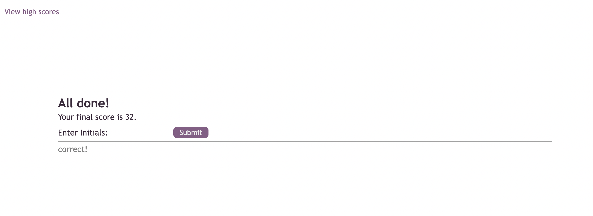

# Code Quiz

## Description

This application is for boot camp students to test their Javascript fundamentals and compare their scores with others.

## Installation

N/A

## Usage

The deployed webpage can be accessed [here](https://phoenixouyang.github.io/code-quiz/).

Once you click 'Start Quiz', you will have 75 seconds to answer all the questions. An incorrect answer will deduct 10 seconds from your time. Your score is based on time left at the end of the quiz.

When you've answered all the questions, you can enter your initials to save your highscore. It will then be displayed on the 'high scores' screen. You can take the quiz and track your score each time.

## Credits

N/A

## License

Please refer to the LICENSE in the repo.
